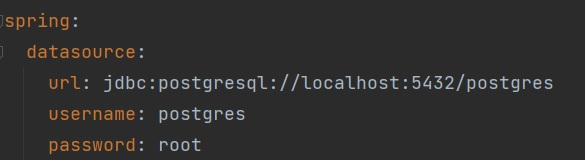
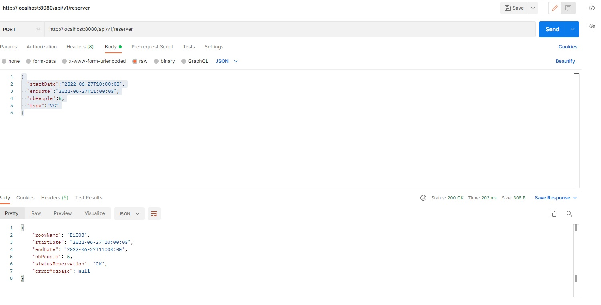

# Prérequis pour lancer l'application :

 - JDK version 8 minimum
 - Une base de données Postgres
 - Docker si vous voulez lancer l'application en mode docker (Optional)

## Configuration de la base de données si vous n'utilisez pas docker

Dans ce cas, vous devez avoir déja installé une base de données postgres, et voud devez modifier les propiètés url, username et password dans 
le fichier application.yml

## Packaging de l'application 

Pour générer le jar de l'application, il faudra lancer la commande suivante dans le repertoire racine :

./mvnw package

## Lancement de l'application en local ( sans docker )

Dans la racine du projet, lancer la commande suivante :

java -jar ./target/MeetingPlanner-0.0.1-SNAPSHOT.jar

## Lancement de l'application en mode docker

Dans la racine du projet, lancer la commande suivante :

docker-compose up -d --build

## Test du Endpoint de réservation

- URL : http://localhost:8080/api/v1/reserver
- méthode : POST
- Body: {
  "startDate":"2022-06-27T10:00:00",
  "endDate":"2022-06-27T11:00:00",
  "nbPeople":5,
  "type":"VC"
  }

## Exemple d'input / output de l'endpoint de réservation

 

